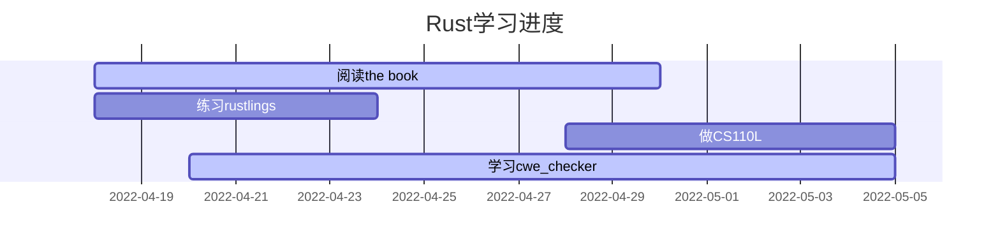

> 记录我学习Rust的过程

## 为什么选择Rust？

* 想对用Rust写的[cwe_checker](https://github.com/fkie-cad/cwe_checker)进行二次开发
* 学习更多有关内存安全的知识，也可以对应到C/C++中的一些程序分析方法
* 想学习一下现代编程语言的特点，也可以对应到C++的一些高级用法
* 了解函数式编程[^fp]

## 如何学习Rust？

感觉Rust的社区很活跃，学习资料也很多。我简单整理了一些如下：

* 书籍：
  * [The Rust Programming Language(the book)](https://github.com/rust-lang/book)：Rust官方书籍
  * [Rust语言圣经](https://course.rs)：Rust中文学习教程
  * [Rust cookbook](https://rust-lang-nursery.github.io/rust-cookbook/)：collection of simple Rust examples
  * [Rusty Book](https://rusty.rs/about.html)：Awesome Rust + Rust Cookbook
  * [Rust编程之道](https://docs.rs/tao-of-rust/1.0.1/tao_of_rust/)：张汉东著
  * [The Little Book of Rust Macros](https://danielkeep.github.io/tlborm/book/index.html)：宏小册

* 练习：
  * [Rustlings](https://github.com/rust-lang/rustlings)：Small Rust exercises
  * [Rust by Example](https://doc.rust-lang.org/rust-by-example/index.html)：A collection of runnable Rust examples
  * [Rust语言实战](https://practice.rs/)：配套《Rust语言圣经》

* 课程：
  * [Rust培训](<https://rustedu.com>)：阿图教育，带着你学以上书籍
  * [CS110L](https://web.stanford.edu/class/cs110l/)：Safety in Systems Programming
  * [KAIST CS431](https://github.com/kaist-cp/cs431)：Concurrent Programming
  * [rCore](https://github.com/LearningOS/os-lectures)：从零开始用Rust写一个基于RISC-V架构的类Unix内核

* 论坛：
  * [Rust语言中文社区](https://rustcc.cn)：包括一些专栏的分享
  * [Rust语言开源杂志](https://github.com/RustMagazine)：月/季度杂志，包括了一些专栏

* 公众号：
  * 2121实验空间
  * 觉学社

* 数据库：
  * [crates.io](https://crates.io)：The Rust community’s crate registry
  * [RustSec](https://rustsec.org/advisories/)：The Rust Security Advisory Database

* 论文：
  * [Learning and Programming Challenges of Rust: A Mixed-Methods Study](https://songlh.github.io/paper/survey.pdf)

## Rust学习计划

使用mermaid[^mermaid]生成的gantt图：

* [ ] 阅读the book
* [x] 做完配套练习rustlings
* [ ] 阅读cwe_checker的源代码
* [ ] CS110L Labs
* [ ] 阅读rust语言圣经
* [ ] 做配套练习rust语言实战

[^fp]: https://zh.wikipedia.org/wiki/函数式编程
[^mermaid]: https://mermaid-js.github.io/mermaid/
