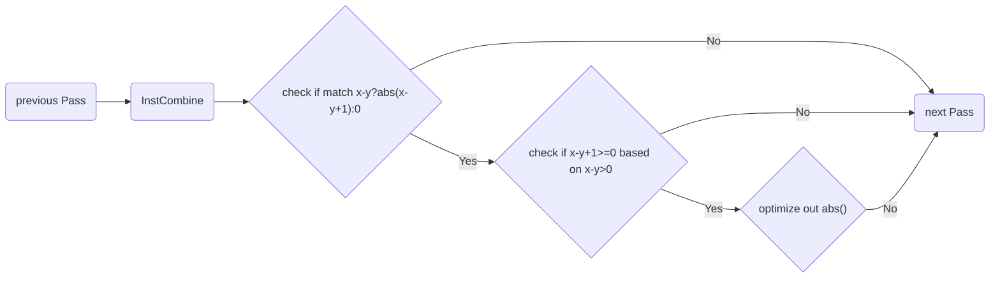

## 项目信息

- 项目名称：[值传播优化] 结合条件分支对分支中的逻辑表达式进行优化
- 项目编号：23b970442
- 项目难度：进阶
- 项目主导师：钟云德 zhongyunde@huawei.com
- 项目主页：https://summer-ospp.ac.cn/org/prodetail/23b970442

## 项目产出

本项目的主要产出包括贡献代码（2 个 commit）、5 份项目开发博客以及 1 份结项报告，具体如下：

- 贡献代码：[https://gitee.com/openeuler/llvm-project/pulls/21](https://gitee.com/openeuler/llvm-project/pulls/21)

  1. 预提交测试代码（**347** LoC），预期输出由现有的 LLVM/Clang 生成，用于后续**对比展示**本次优化的效果
  2. 提交功能代码（**107** LoC），将测试代码的预期输出修改为由能力提升后的 LLVM/Clang 生成，并补充 alive2 的结果（**32** LoC）

  功能部分的实现逻辑可以由下图概括：



  由于主项目分支受到保护，当前的改动暂时合并到了：https://gitee.com/openeuler/llvm-project/pulls/28

- 项目开发博客：[https://gitee.com/cascades/llvm-project/wikis](https://gitee.com/cascades/llvm-project/wikis)，按照时间顺序列出：

  1. InstCombine调研：调试了现有的 LLVM/Clang 处理三元表达式和 abs 语句的结果和流程
  2. InstCombine开发：在转换为 Intrinsic 的基础上添加模式匹配代码，完成初步开发
  3. Intrinsic调研：调研代码重构的可行性，即在统一在生成 Intrinsic 之前完成代码优化
  4. InstCombine测试：如何添加、运行测试代码，以及如何写出好的测试代码
  5. InstCombine迭代：记录了在合入代码之前的迭代过程

## 项目时间规划

从 07/19 开始，每周三下午和项目导师开一次会对齐项目进度，然后我会在每周末花 4-8 小时左右的时间完成这周的开发任务。实际的项目进度比预期规划有提前，具体如下：

|      时间     |                                              任务                                              |
|:-------------:|:----------------------------------------------------------------------------------------------:|
| 07/01 - 07/18 |                   调研现有的 InstCombine 能力；熟悉 LLVM/Clang 开发和调试环境                  |
| 07/19 - 07/26 |     完成了初步的调试和基于模式匹配的开发；用自定义 Makefile 的方式完成了基础测试用例的编写     |
| 07/26 - 08/02 | 完成了对于 select pattern 的调研；添加了拓展测试用例；采用分阶段的方式完成了本项目的优化和测试 |
| 08/02 - 08/09 |       完成了代码重构，统一了本项目进行优化的位置；将自定义的测试文件用 LLVM 测试框架重写       |
| 08/09 - 08/16 |                 补充了 corner case 的优化；完成单元测试，尝试合入代码到上游仓库                |
| 08/16 - 08/23 |                    正式提交 PR，完成了对于检视意见的修改，增加了更多 feature                   |
| 08/23 - 09/06 |                              等待正式合入 PR；申请开源之夏人物采访                             |
| 09/06 - 09/20 |                               撰写结项报告；完成开源之夏人物采访                               |

## 项目心得

项目开发中的细节类心得都记录在[开发博客](https://gitee.com/cascades/llvm-project/wikis)里了，印象比较深刻的记录如下：

- 如何在成熟项目的基础上进行开发，如何重构，如何符合大型项目的代码规范？

  本项目是在 LLVM 仓库内开发的，众所周知，这是最当前最符合现代 C++ 开发规范的大型软件之一，所以一开始我也是带着敬畏之心去学习它的代码写法。

  首先，**从开发逻辑上，我就被上了一课。**因为 LLVM 已经有成熟的优化框架和 API 了，所以很多时候不需要，也不推荐使用端到端的优化方式，从而这也需要开发者通过查看优化过程 Log 的方式来了解 Pass Pipeline 中每个阶段的优化结果。

  **在实现了初始功能的代码之后，我通过重构进一步加深了对于整个优化流程的理解。**因为项目所要求的几类表达式在现有的 Pipeline 中会在不同的阶段被处理，所以需要在不同的代码目录下找到对应的函数添加模式匹配的代码，这样会增加开发和调试的负担。在我重新对整个过程进行调试之后，发现了更适合进行统一优化的地方，也使得最后产出的代码更加统一。

  此外，在判断匹配逻辑的写法上，在代码结构的组织上，在测试代码的规范上，命令行参数的设置上，老师也给了很多指导性的建议，让我去对齐 LLVM 官方的写法，这也都是一般的软件项目不具备的。

- 如何回应提交代码之后的建议？

  在准备提交代码后，我以为已经完成了所有的开发工作，然而后续的修改意见其实也很重要。初始的 PR 一共包含 **108** 个评论，大部分意见是针对代码规范性的，也有针对测试用例的，也有针对具体的 IR 细节的（NSW 标志）。总体来说，这么多的意见是因为有时候我写的代码是违反 reviewer 直觉的，所以需要专门解释一下。比如在编写算术表达式对应的 IR 时，需要捕获其在 Pass Pipeline 中的形式，这与直接手写 IR 的结果是不一样的。


## 项目后续发展

在项目将要完成的时候，我也和项目导师对于项目之后的进一步发展进行了讨论：

- 如何使用形式化验证工具（求解器）来处理更通用的表达式场景？

  本次优化其实属于模式匹配类的工作，换而言之，值传递的功能仍然是通过专家经验/数学常识来实现的：每次新增一个表达式类型，都需要人为地通过数学经验来判断优化的可行性。但我在编写拓展测试用例的时候也会发现，类似的模式是很难穷举的，本项目也只涉及了一元一次表达式。一个更加通用的想法是直接使用求解器来给出优化的可行性。抽象来看，这一类的优化主要和两个表达式有关，即`C ? abs(P): 0`中的表达 $C$ 和 $P$，只有当 $C => P>=0$ 时，才能优化掉 abs 函数。所以整个优化的可行性可以转化为可满足性问题，举例如下：

  ```python
  from z3 import *
  x = Input("x")
  y = Input("y")
  s = Solver()
  s.add(x-y>0) # apply C as constraint
  s.add(x-y+1<0) # apply !P as constraint
  s.check() # check satisfiability -> unsat
  # x-y?abs(x-y+1):0 can be optimized！
  ```

  当然，鉴于本人对于求解器的了解有限，这个想法还是不够成熟。或许这个想法和 alive2 的思路是重合的，所以这个想法的 motivation 也有待加强。此外，将求解器引入到常规的优化流程中会大大增加编译时间，不太现实，所以此方法作罢。

- 如何将数据流分析引入到当前类的优化当中？

  从优化范围来看，本项目所实现的只能叫做窥孔（Peephole）优化，即三元表达式的局部优化。但根据我搜索大型代码库的情况（通过静态模式匹配，或者是通过动态引入编译器 panic ），会发现这样的局部优化的场景是不多见的。所以如果这项优化的思路能够利用到 LLVM 中的数据流传播的信息，使得 abs 内部的表达式的值不仅仅取决于外部的三元表达式，还取决于更前面的路径条件，从而能够获得更 sound 的分析。

## 个人收获

总体而言，我在该项目上的投入产出比是可观的，自己的调试能力和开发经验也都有提高。感谢钟云德老师对我各种幼稚的想法的指点，以及向我介绍各种开发思路和辅助工具。当然，对于我而言，我更感兴趣的还是静态程序分析，或者说是 Analysis 类的优化和分析，但从这次项目的经历看来，锻炼锻炼基本功总是好的。